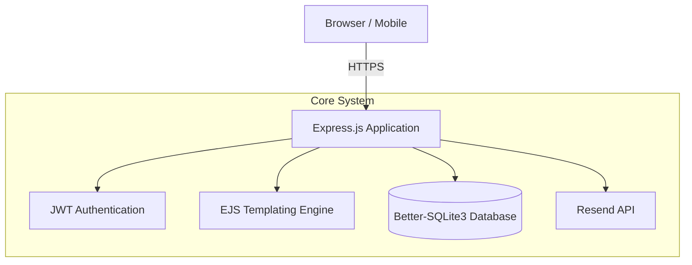
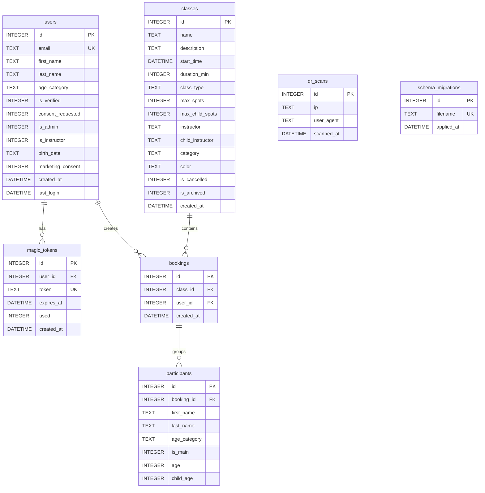

<div align="center">
  <h1>🧗Fantastyczne Wspinanie</h1>
  <p><strong>Climbing Class Registration & Management System</strong></p>

  [](https://github.com/prod-explore/SKARPA/actions)
  [](https://nodejs.org/)
  [](https://www.sqlite.org/)
</div>

## 📌 Overview

**Fantastyczne Wspinanie** is a secure, lightweight, and fast web application designed to manage complex registrations and attendance for climbing classes. Built as part of a structured program, it provides instructors with powerful tools to manage participant lists while offering a seamless registration experience for students and parents.

Unlike generic CMS solutions, this platform focuses heavily on **business logic tailored for sports facilities**: a dynamic class schedule, complex instructor-level permissions, and granular participant tracking.

---

## 🏗️ Architecture

The system is a monolith Node.js application built with Express, utilizing a local SQLite database for high-performance, low-overhead data management.



---

## 🧠 Key Decisions

- **Why SQLite over PostgreSQL/MySQL?**: The system is designed as a single-tenant deployment for one climbing facility. Using `better-sqlite3` provides ultra-fast, synchronous data access without network overhead (TCP/IP). With WAL (Write-Ahead Logging) mode enabled, it easily handles the required read/write concurrency while eliminating the need to manage and maintain a separate database server.
- **Why Server-Side Rendering (EJS) over a SPA?**: The application consists primarily of complex registration forms, attendance lists, and schedules. SSR significantly reduced time-to-market for a solo developer by removing the overhead of building and maintaining a separate REST API and frontend state management. Furthermore, SSR ensures an immediate "First Contentful Paint," which is critical for instructors and parents accessing the site on mobile devices within climbing gyms where internet coverage is often poor.
- **Schema Evolution (Iterative Development)**: The data model evolved continuously alongside business requirements. Major pivots included implementing Role-Based Access Control (RBAC) to separate admin/instructor views, adding age categories and parental consent workflows for minors, and restructuring the class schedule tables (`max_child_spots`, `child_instructor`) to support a unique "Dual Capacity" system where adult classes run parallel to dedicated children's animations.

---

## ✨ Features

### 👨‍🏫 Instructor & Account Management
- **Role-Based Access Control (RBAC)**: Secure access tailored specifically for Instructors and Administrators via JWT tokens.
- **Granular Instructor Profiles**: Each instructor has a dedicated account with access strictly limited to their assigned classes.
- **Cross-List Permissions**: Advanced logic allows designated instructors (e.g., animation coordinators) to access specialized cross-lists while maintaining the security of primary climbing lists.

### 📅 Class Calendar & Scheduling
- **Dynamic Registration Schedules**: Automated class slots available for sign-ups based on day of the week, instructor availability, and class type (e.g., beginner, advanced, children's animations).
- **Attendance Tracking**: Real-time participant list management allowing instructors to quickly check in students directly from their mobile devices during classes.
- **Capacity Control**: Automatic caps on class sizes to prevent overbooking, ensuring a safe climbing environment.

### 🔒 Security & Operations
- **Automated Email Notifications**: Integration with the `Resend` API for transactional emails, registration confirmations, and important schedule changes.
- **Security Hardened**: Protected against common web vulnerabilities via `helmet`, `express-rate-limit`, and data validation (`validator`).
- **Server-Side Rendering**: Fast, SEO-friendly, and accessible views rendered natively via EJS.
- **Containerized**: Fully Dockerized for instant, reproducible deployments across any environment.

---

## 🗄️ Database Schema (ERD)



---

## 📦 Schema Migrations

The schema evolves through numbered SQL files. To add a change, create a new file — it will be applied automatically on next startup:

```
src/migrations/
├── runner.js                   ← migration runner (tracks history, atomic transactions)
├── 001_init_schema.sql
├── 002_user_verification.sql
├── 003_instructor_role.sql
├── 004_family_classes.sql
└── 005_class_color_archive.sql
```

---

## 🚀 Getting Started

### Prerequisites
- Node.js (v18+)
- Docker & Docker Compose (Optional, for containerized deployment)
- Resend API Key

### Installation (Local)

1. **Clone the repository:**
   ```bash
   git clone https://github.com/your-org/skarpa-bytom.git
   cd skarpa-bytom
   ```

2. **Configure Environment Variables:**
   Copy the example environment file and fill in the values:
   ```bash
   cp .env.example .env
   ```
   *Make sure to set your `RESEND_API_KEY` and `JWT_SECRET`.*

3. **Install Dependencies:**
   ```bash
   npm install
   ```

4. **Run the Application:**
   ```bash
   npm start
   ```

### Installation (Docker)

```bash
docker-compose up --build -d
```
The application will be exposed on the port defined in your `docker-compose.yml`.

---

## 🧪 Tests

```bash
npm test
```

Integration tests use an in-memory SQLite database — covers bookings, participant counts, duplicate prevention, cascade deletes, and spot limits.

---

## 🤖 CI/CD Pipeline

The project uses **GitHub Actions** for continuous integration. Every push and Pull Request to the `main` branch triggers an automated pipeline that:
1. Sets up the environment using cached dependencies (faster builds).
2. Runs the full integration test suite (`npm test`) on an isolated in-memory database.
3. Ensures code stability before any deployment.

---

## 📂 Technical Stack

- **Backend framework**: Express.js
- **Database**: SQLite (via `better-sqlite3`)
- **Authentication**: JSON Web Tokens (`jsonwebtoken`)
- **Email Delivery**: Resend (`resend`)
- **Templating**: EJS
- **Security**: Helmet, Express Rate Limit, Cookie Parser

---
<div align="center">
  <i>Developed for Fantastyczne Wspinanie.</i>
</div>
