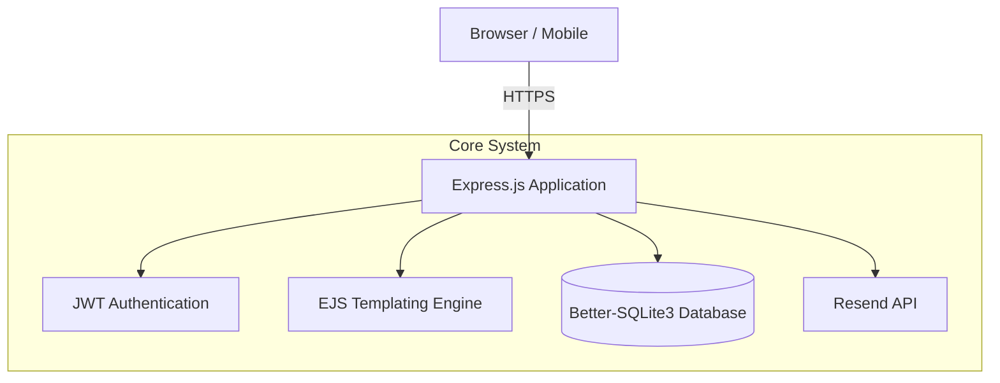

<div align="center">
  <h1>🧗Fantastyczne Wspinanie</h1>
  <p><strong>Climbing Class Registration & Management System</strong></p>
</div>

## 📌 Overview

**Fantastyczne Wspinanie** is a secure, lightweight, and fast web application designed to manage registrations and attendance for climbing classes. Built as part of a structured program, it provides instructors with powerful tools to manage participant lists while offering a seamless registration experience for students and parents.

---

## 🏗️ Architecture

The system is a monolith Node.js application built with Express, utilizing a local SQLite database for high-performance, low-overhead data management.



---

## ✨ Features

- **Role-Based Access Control (RBAC)**: Secure access tailored for Instructors and Administrators via JWT tokens.
- **Participant Management**: Dynamic cross-list access (e.g., specific instructors managing children's animation lists).
- **Automated Email Notifications**: Integration with the `Resend` API for transactional emails and registration confirmations.
- **Security Hardened**: Protected against common web vulnerabilities via `helmet`, `express-rate-limit`, and data validation (`validator`).
- **Server-Side Rendering**: Fast, SEO-friendly, and accessible views rendered via EJS.
- **Containerized**: Fully Dockerized for instant, reproducible deployments across any environment.

---

## 🚀 Getting Started

### Prerequisites
- Node.js (v18+)
- Docker & Docker Compose (Optional, for containerized deployment)
- Resend API Key

### Installation (Local)

1. **Clone the repository:**
   ```bash
   git clone https://github.com/your-org/skarpa-bytom.git
   cd skarpa-bytom
   ```

2. **Configure Environment Variables:**
   Copy the example environment file and fill in the values:
   ```bash
   cp .env.example .env
   ```
   *Make sure to set your `RESEND_API_KEY` and `JWT_SECRET`.*

3. **Install Dependencies:**
   ```bash
   npm install
   ```

4. **Run the Application:**
   ```bash
   npm start
   ```

### Installation (Docker)

```bash
docker-compose up --build -d
```
The application will be exposed on the port defined in your `docker-compose.yml`.

---

## 📂 Technical Stack

- **Backend framework**: Express.js
- **Database**: SQLite (via `better-sqlite3`)
- **Authentication**: JSON Web Tokens (`jsonwebtoken`)
- **Email Delivery**: Resend (`resend`)
- **Templating**: EJS
- **Security**: Helmet, Express Rate Limit, Cookie Parser

---
<div align="center">
  <i>Developed for Fantastyczne Wspinanie.</i>
</div>
